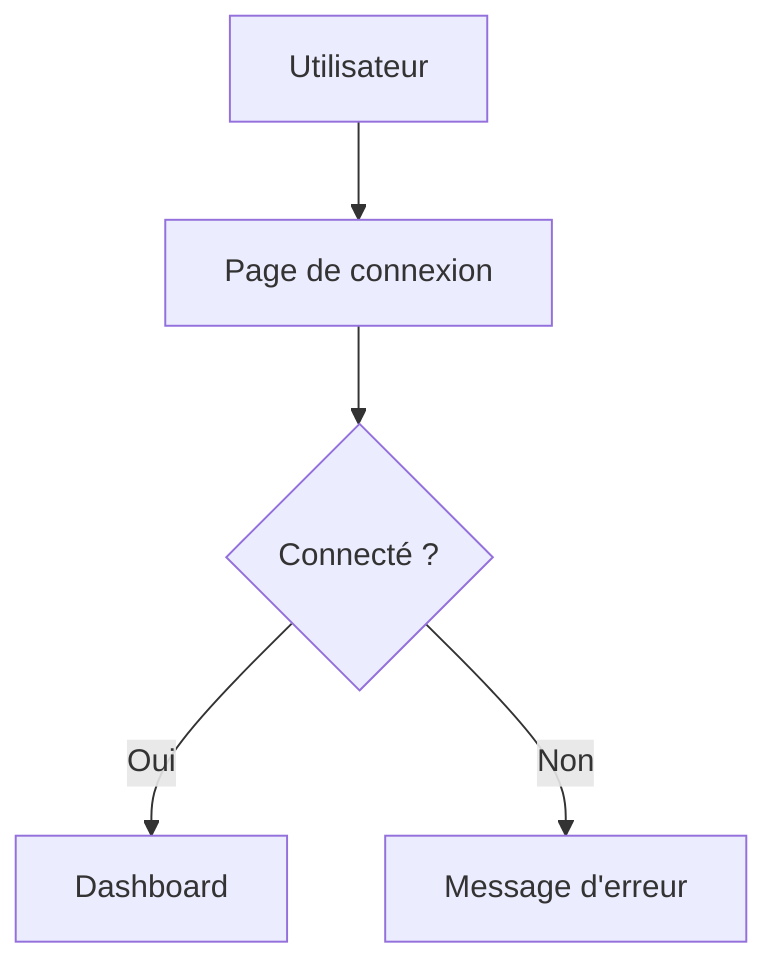

# Sommaire
---
| Étape | Description | Statut |
|-------|--------------|--------|
| 1 | Analyse du besoin | ✅ Terminé |
| 2 | Maquettes | 🟡 En cours |
| 3 | Développement | 🔜 À venir |

| À gauche | Centré | À droite |
|:----------|:------:|---------:|
| texte | texte | texte |


> "Une citation ou un point important à retenir."

> 💡 **Astuce :** garde les titres cohérents dans tout ton document.


*Figure 1 : Page d'accueil de l'application Tosho*


1. Introduction
2. Objectifs
   - Objectif principal
   - Objectif secondaire
3. Résultats


```html
<div class="card">
  <h2>Titre</h2>
</div>
```

<div style="background:#f0f9ff; padding:10px; border-left:4px solid #0ea5e9;">
💡 **Astuce :** tu peux combiner Markdown et HTML !
</div>

# 📑 Sommaire

| Section | Page |
|----------|------|
| Couverture | 1 |
| Introduction | 2 |
| Objectifs du projet | 3 |
| Cahier des charges | 4 |
| Conception | 6 |
| Résultats | 10 |
| Annexes | 12 |

> [!warning] Attention
> Ne pas oublier d’activer `enableScriptExecution` pour Mermaid.

---
title: "Dossier de projet – Exemple Markdown"
author: "Ton Nom"
date: "Octobre 2025"
---

pour un saute de page
<div style="page-break-before: always;"></div>


# 📘 Couverture

<div style="text-align:center; margin-top:100px;">
  <h1>📘 Nom du Projet</h1>
  <h3>Sous-titre du projet ou slogan</h3>
  <p>Développé par <strong>Ton Nom</strong><br>
  Formation Développement Web et Web Mobile<br>
  Octobre 2025</p>
</div>

---

# 📑 Sommaire

[[TOC]]

---

# 🏁 Introduction

> 🎯 **Objectif du dossier :** présenter la conception, la réalisation et les résultats du projet.  
> 💡 Conseil : garde un ton clair, professionnel et concis.

---

# 🎯 Objectifs du projet

- Présenter le **contexte** et les **besoins**
- Identifier les **objectifs fonctionnels**
- Décrire les **contraintes techniques**

| Type | Détail | Priorité |
|------|---------|----------|
| Fonctionnel | L'utilisateur peut emprunter un livre | 🟢 Haute |
| Technique | Utiliser Symfony + MySQL | 🟡 Moyenne |
| Interface | Interface responsive mobile/desktop | 🔵 Moyenne |

---

# 🧩 Cahier des charges

## 👥 Acteurs du système
| Acteur | Rôle | Description |
|--------|------|-------------|
| 👨‍🏫 Admin | Gère les comptes | Ajoute / supprime des utilisateurs |
| 📚 Bibliothécaire | Gère les prêts | Enregistre les livres et les retours |
| 👩‍👧 Parent | Emprunteur | Consulte le catalogue et réserve un livre |

---

## ⚙️ Fonctionnalités principales

- Créer / modifier / supprimer un livre
- Rechercher un livre par nom ou famille
- Enregistrer un prêt et un retour
- Consulter l’historique des emprunts

> [!info] Astuce
> Organise tes fonctionnalités en tableau ou liste numérotée pour la clarté.

---

# 🧠 Conception

## 🧭 Diagramme de flux (Mermaid)

```mermaid
flowchart TD
    A[Utilisateur] --> B[Page de connexion]
    B --> C{Connecté ?}
    C -->|Oui| D[Tableau de bord]
    C -->|Non| E[Message d'erreur]

