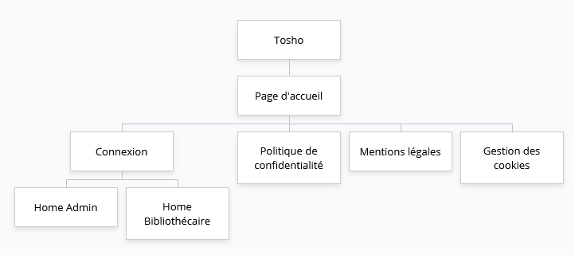
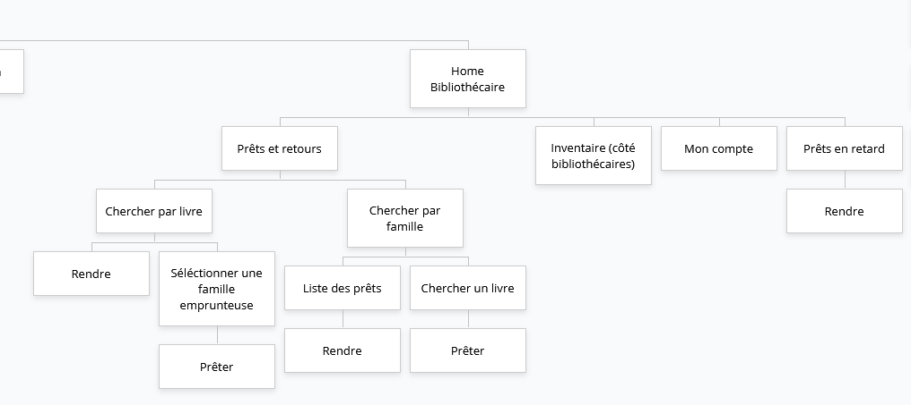
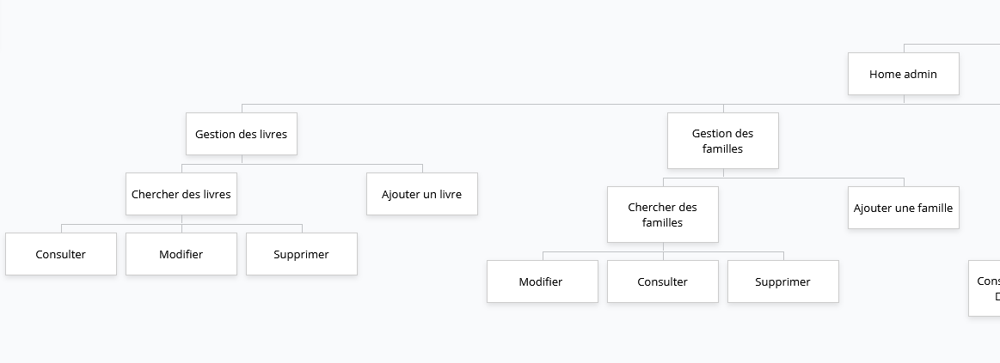
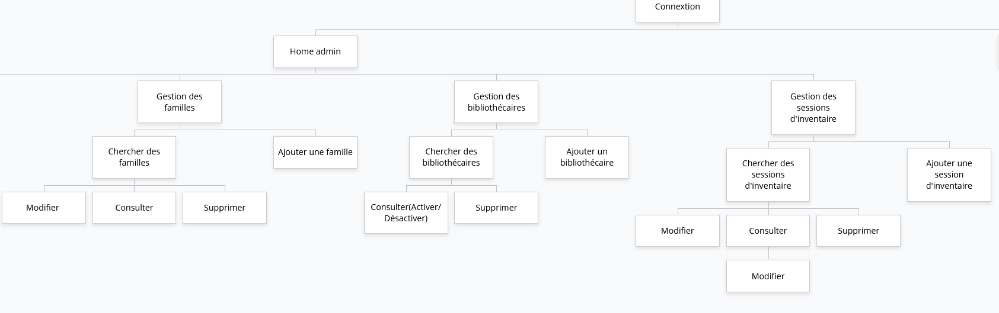
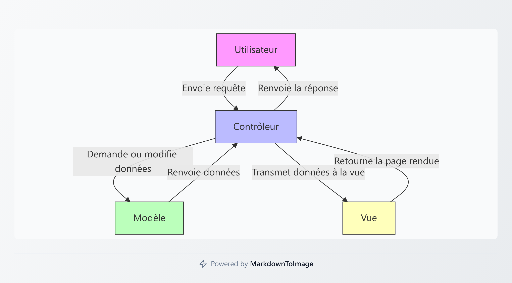
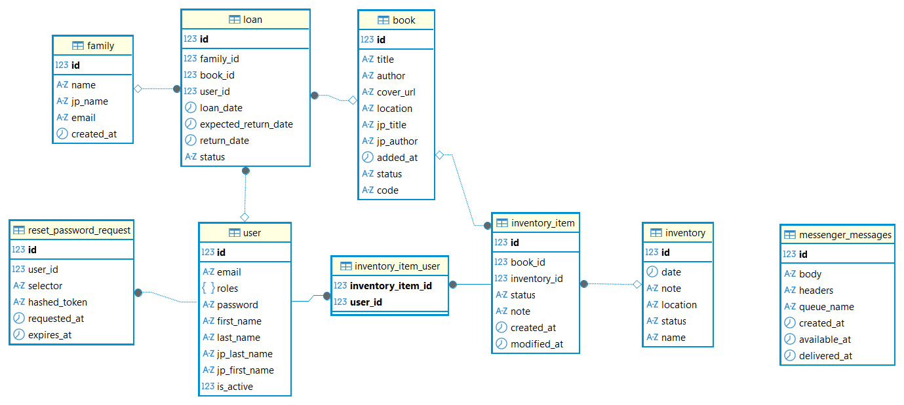

**Développé par Miyuki CHERBAL**

---

# Présentation du projet

## **Tosho – Application de gestion de bibliothèque**

- _Tosho_ signifie **« bibliothèque »** ou **« livre »** en japonais
- Projet réalisé pour une **école japonaise associative** dirigée par des **parents bénévoles**
- Application actuelle :
  - Fonctionnalités **limitées**
  - Pas d’**accès administrateur**
  - Interface **simple**, peu **intuitive**

---

# Objectif et MVP

## Objectif

- Faciliter la **gestion des prêts et retours**
- Fournir une **interface administrateur**

## MVP

- **Enregistrer un prêt ou un retour**
- **Rechercher un prêt** par livre ou par famille
- **Interface admin** pour que les bénévoles travaillent en autonomie
- Plus besoin de dépendre du **développeur initial**

---

# Rôles et fonctionnalités

| Type d’utilisateur | Fonctionnalités                                                                                                                                                                                                                                                                                                     |
| ------------------ | ------------------------------------------------------------------------------------------------------------------------------------------------------------------------------------------------------------------------------------------------------------------------------------------------------------------- |
| **Bibliothécaire** | - Gérer les **prêts** et **retours** de livres   - Participer à une **session d’inventaire**                                                                                                                                                                                                                     |
| **Admin**          | - **Livres** : CRUD   - **Familles** : CRUD   - **Sessions d’inventaire** : créer, suivre l’avancement, mettre à jour le statut, supprimer   - **Bibliothécaires** : créer un compte, envoyer email automatique, activer/désactiver, supprimer   - **Supervision** : accès à l’interface bibliothécaire |

---

#  Contraintes

- Interface **simple et intuitive** pour des bénévoles non techniques
- **Gestion des accès** selon le rôle :
  - **Administrateurs** : toutes les fonctionnalités
  - **Bibliothécaires** : prêts et inventaire uniquement
- **Données fiables et en temps réel** pour éviter les doublons et les erreurs d’inventaire

---

# Gestion de projet

- **Liste des fonctionnalités** → Cahier des charges & User stories en Markdown

  
  

---

# Wireframes & Maquettes

## Objectif

- Clarifier la **structure et le parcours utilisateur**
- Vérifier l’**ergonomie** avant le développement

---

## Wireframes – Aperçu

  

---

## Maquettes Figma – Aperçu

  
  

---

# Outils utilisés

<table style="width:100%; text-align:center;">
  <tr>
    <td> Git</td>
    <td> GitHub</td>
    <td> VS Code</td>
    <td> XAMPP</td>
    <td> WSL Ubuntu</td>
  </tr>
  <tr>
    <td> Docker</td>
    <td> Postman</td>
    <td> DBeaver</td>
    <td> Git Bash</td>
    <td></td>
  </tr>
</table>

---

# Charte graphique

## Palette de couleurs

  
  
  

---

# Charte graphique
## Logo

## Icônes

  
  
  
  
  

### Identité visuelle ludique conviviale et accessible pour des parents bénévoles non techniques

---

# Arborescence

---
# Arborescence

---
# Arborescence

---
# Arborescence

---

# Stack technique

## Front-end
<table style="width:100%; text-align:center;">
<tr>
    <td> HTML</td>
    <td> CSS</td>
    <td> Twig</td>
    <td> JavaScript</td>
</tr>
</table>

## Back-end
<table style="width:100%; text-align:center;">
<tr>
    <td> PHP 8.2</td>
    <td> Symfony 6.4</td>
    <td> MySQL</td>
</tr>
</table>

---

# Architechture MVC

---

# Modèle de donnés

---

# Développement

## Front-end

### Mise en place des onglets

*loan/index.html.tiwg*

*_tabs.css*

*LoanController.php*

---

# Développement

## Front-end

### Stimulus

---

# Développement
## Back-end

### 

---

# Sécurité
## Gestion d'accès

---
# Sécurité
## Protection des donnés

---

# Déploiement

## Configuration Docker

---
# Déploiement
## Mise en production & Documentation

---

# Difficultés rencontrés

## Problème de récupération des donnés dû à Lazy Roading

---

# Démo

---

# Conclusion

- **Mise en pratique des compétences web**  
  HTML, CSS, JS, PHP, Symfony, intégration fidèle aux maquettes

- **Résolution de problèmes techniques**  
  Débogage, optimisation, interactions dynamiques

- **Vision complète du cycle de développement**  
  Analyse des besoins → conception → développement → tests → optimisation
---

# Roadmap

- **Perspectives et projet pro**  
  - Tosho utilisé en conditions réelles par l’association
  - Refonte de site de l'asso en VueJs
  - Alternance

- **Évolutions futures**  
  - Recherche interactive AJAX  
  - Interface multilingue FR / JP  
  - Planning parents-bibliothécaires  
  - Réservation en ligne

