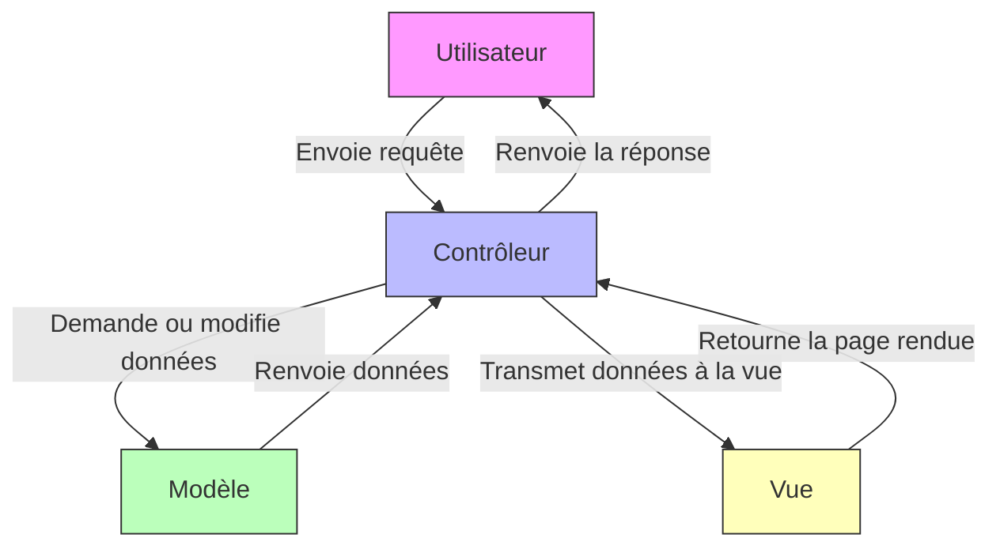

<div style="text-align:center; margin-top:300px;">

  

  <div style="margin-top:200px">
    <p>Développé par <strong>Miyuki CHERBAL</strong></p>
    <p>Titre professionnel visé : <strong>Développeur Web et Web Mobile</strong></p>
    <p>Novembre 2025</p>
  </div>

</div>

<div style="page-break-after: always;"></div>

---

# Sommaire

1. [Introduction](#1-introduction)

2. [Compétences du référentiel couvertes par le projet](#2-compétences-du-référentiel-couvertes-par-le-projet)

   - [2.1 Développer la partie front-end d’une application web ou web mobile sécurisée](#21-développer-la-partie-front-end-dune-application-web-ou-web-mobile-sécurisée)

   - [2.2 Développer la partie back-end d’une application web ou web mobile sécurisée](#22-développer-la-partie-back-end-dune-application-web-ou-web-mobile-sécurisée)

3. [Cahier des charges](#3-cahier-des-charges)
   - [3.1 Contexte et objectifs](#31-contexte-et-objectifs)
   - [3.2 User stories](#32-user-stories)
   - [3.3 Contraintes](#33-contraintes)

4. [Conception visuelle](#4-conception-visuelle)
   - [4.1 Charte graphique](#41-charte-graphique)
   - [4.2 Wireframes](#42-wireframes)
   - [4.3 Maquettes](#43-maquettes)

5. [Conception technique](#5-conception-technique)
   - [5.1 Technologies utilisées](#51-technologies-utilisées)
   - [5.2 Versionning](#52-versionning)
   - [5.3 Architecture MVC](#53-architecture-mvc)
   - [5.4 Base de données](#54-base-de-données)
   - [5.5 Sécurité](#55-sécurité)

6. [Développement](#6-déveleppement)
   - [6.1 Front-end](#61-front-end)
   - [6.2 Back-end](#62-back-end)

7. [Jeu d’essai](#7-jeu-dessai)
   - [7.1 *(à compléter)*](#71-à-compléter)

8. [Déploiement](#8-déploiement)

9. [Veille technologique](#9-veille-technologique)

10. [Documentation en anglais](#10-documentation-en-anglais)
      - [10.1 Contexte](#101-contexte)
      - [10.2 Early Return vs. Classic If-Else: A Universal Pattern for Writing Cleaner Code](#102-early-return-vs-classic-if-else-a-universal-pattern-for-writing-cleaner-code)
      - [10.3 Retour anticipé contre l'If-Else classique : Un modèle universel pour écrire du code propre](#103-retour-anticipé-contre-lif-else-classique--un-modèle-universel-pour-écrire-du-code-propre)

11. [Conclusion](#11-conclusion)
    - [11.1 Bilan global du projet](#111-bilan-global-du-projet)
    - [11.2 Roadmap](#112-roadmap)


<div style="page-break-after: always;"></div>

---

# 1. Introduction

Tosho est une application web conçue pour faciliter la gestion des prêts de livres au sein d’une école japonaise. En japonais, *Tosho* signifie *« bibliothèque »* ou *« livre »*.

L'origine de ce projet remonte directement à mon expérience personnelle. Ma fille, née en France, apprend le japonais dans une école destinée aux enfants d’origine japonaise. Cette école est gérée entièrement par des parents bénévoles, dont je fais partie. Nous y disposons d’une petite bibliothèque et nous prêtons régulièrement les livres aux familles afin que les enfants se familiarisent avec la lecture en japonais.

L’application actuellement utilisée pour les prêts de livres manque d’ergonomie et de fonctionnalités essentielles. L’interface administrateur n’est accessible que par le développeur initial, un ancien parent bénévole, et bien qu’elle reste fonctionnelle, elle présente une interface brute sans mise en forme CSS.

Tosho a pour objectif de simplifier la gestion des prêts de livres au quotidien, tout en offrant une expérience utilisateur plus fluide et moderne. Cette solution permet aux parents bénévoles de disposer d’un outil clair et autonome pour centraliser et gérer efficacement la bibliothèque.

Ce projet m’a permis de mettre en pratique les compétences acquises au cours de ma formation de Développeur Web et Web Mobile, de la conception au déploiement. J’ai pu expérimenter l’ensemble du processus de développement : analyse des besoins, architecture logicielle, gestion de la base de données, développement front-end et back-end, ainsi que la sécurisation des accès et la mise en place d’une interface responsive. 

Tosho est mon premier projet concret, reflet de mon apprentissage et de mon évolution en tant que développeuse, dont je suis fière de pouvoir présenter aujourd’hui !


<div style="page-break-after: always;"></div>

---


# 2. Compétences du référentiel couvertes par le projet 

## 2.1 Développer la partie front-end d’une application web ou web mobile sécurisée

### Installer et configurer son environnement de travail

Pour ce projet, j’ai utilisé **Visual Studio Code (VSCode)** comme environnement de développement, un **IDE** (Integrated Development Environment) que j’utilise depuis le début de ma formation. Je l’ai progressivement configuré selon mes besoins, en installant diverses extensions utiles pour les langages de programmation et leurs frameworks, notamment :
- **PHP Intelephense** : pour bénéficier de l’autocomplétion, de la détection d’erreurs, et d’une meilleure navigation dans le code PHP.

- **PHP Namespace Resolver** : pour faciliter l’importation et la gestion automatique des namespaces dans les fichiers PHP.

- **Twig Language 2** : pour améliorer la coloration syntaxique et l’autocomplétion des fichiers Twig utilisés dans Symfony.

Cette configuration m’a permis de travailler de manière plus efficace et structurée tout au long du projet, en optimisant la lisibilité du code et en réduisant les erreurs de syntaxe.
Le projet est versionné avec **Git** et **GitHub** pour assurer le suivi des modifications et la sauvegarde.

### Maquetter des interfaces utilisateur web ou web mobile

J’ai réalisé les wireframes de mon application pour les formats mobile et desktop en utilisant **Figma**. Cette étape m’a permis de définir l’ergonomie et l’organisation des éléments. Ensuite, j’ai transformé ces wireframes en **maquettes**, ce qui m’a aidée à mieux anticiper les besoins visuels. Avoir un rendu concret sous les yeux m’aide à me projeter dans le développement et à rester concentrée sur le développement.

### Réaliser des interfaces utilisateur statiques web ou web mobile

J’ai intégré mes maquettes graphiques au fur et à mesure de l’avancement du développement back-end. Pour chaque route définie, j’ai créé un dossier dédié dans le répertoire des ``templates``, contenant les fichiers ```.twig``` nécessaires à l’affichage de la vue correspondante. Cette structure permet de maintenir une séparation claire entre les différentes parties de l’application et de gagner en efficacité lors de l’intégration des interfaces utilisateur. J’ai également veillé à ce que l’interface soit responsive.

### Développer la partie dynamique des interfaces utilisateur web ou web mobile

Pour rendre l’interface plus interactive, j’ai utilisé **JavaScript**, notamment pour automatiser certaines actions et améliorer l’expérience utilisateur. Par exemple, lors de la saisie d’un code ISBN dans le formulaire d’ajout d’un livre, un appel est automatiquement envoyé à une **API** externe. Celle-ci retourne les informations liées au livre : titre, auteur, image de couverture, etc. Ces données sont ensuite affichées dynamiquement dans le formulaire, sans rechargement de la page. 

## 2.2 Développer la partie back-end d’une application web ou web mobile sécurisée

### Mettre en place une base de données relationnelle

J’ai mis en place une base de données relationnelle avec **MySQL**. J’ai commencé par concevoir un modèle de données sur papier afin de définir les différentes entités et les relations entre elles. Ensuite, j’ai créé ces entités dans **Symfony** en utilisant **Doctrine ORM**. Chaque entité correspond à une table dans la base de données. Grâce à **CLI** (Command Line Interface) de Symfony, j’ai pu générer automatiquement la structure de la base de données, sans avoir à créer manuellement chaque table. Doctrine simplifie également la gestion des relations entre les entités (OneToMany, ManyToOne, etc.).

### Développer des composants d’accès aux données SQL

Pour accéder aux données stockées dans la base, j’ai utilisé les ``repositories`` fournis par Doctrine. Lorsqu’une requête est envoyée à un contrôleur, celui-ci interagit avec ``Entity Manager`` qui sert d’intermédiaire entre les contrôleurs et les repositories.
Les repositories permettent de récupérer, filtrer, modifier ou supprimer les données de manière sécurisée. Doctrine gère également les connexions à la base de données et applique automatiquement des protections contre les injections SQL.

### Développer des composants métier coté serveur

J’ai structuré mon projet selon **l’architecture MVC (Modèle – Vue – Contrôleur)** de Symfony, afin de séparer clairement la logique métier, l’affichage et le traitement des requêtes. Chaque URL est associée à une route, dirigée vers un contrôleur dédié à une fonctionnalité précise (par exemple : prêts des livres, gestion des inventaires etc.).
Les contrôleurs interagissent avec les entités pour récupérer ou modifier les données, puis transmettent les résultats aux vues. Ce mécanisme est utilisé notamment pour la gestion complète du CRUD des livres.

### Documentner le déploiement d’une application dynamique web ou web mobile

Pour le déploiement, j’ai utilisé **Docker**, ce qui permet de standardiser l’environnement de développement et de production. J’ai rédigé un ``dockerfile`` qui décrit toutes les étapes nécessaires pour construire l’image de l’application : installation des dépendances, configuration, copie des fichiers, etc.
Toutes les commandes nécessaires à l’exécution du projet avec Docker sont documentées dans le fichier ``README.md``. Cela permet à n’importe quel utilisateur de cloner le dépôt et de lancer l’application en quelques lignes de commande, sans avoir à configurer manuellement l’environnement.

<div style="page-break-after: always;"></div>

---


# 3. Cahier des charges
## 3.1 Contexte et objectifs
### Contexte
Le projet **Tosho** est inspiré d’une application web actuellement utilisée au sein d’une école japonaise associative qui propose des cours de japonais aux enfants d’origine japonaise. L’école est entièrement gérée par des parents bénévoles, dont je fais partie, et met à disposition une petite bibliothèque afin d’encourager la lecture en japonais auprès des enfants.

Chaque semaine, les familles adhérentes peuvent emprunter des livres pour leurs enfants. Jusqu’à présent, ces prêts sont gérés via une application web existante, développée il y a plusieurs années par un ancien parent bénévole.
Le fonctionnement actuel est le suivant :

1. La famille choisit les livres à emprunter.

2. Chaque livre possède une étiquette avec un code unique (différent de l’ISBN) généré par l’association.

3. Le parent bibliothécaire saisit le nom de famille de l’emprunteur.

4. La liste des livres déjà empruntés par cette famille s’affiche.

5. Si la famille rapporte des livres, le bibliothécaire enregistre le retour de chaque livre.

6. Pour enregistrer un nouveau prêt, il saisit le code du livre correspondant.

Bien que cette application soit fonctionnelle, elle présente plusieurs limitations importantes :

- La partie administrateur (gestion des livres, des familles adhérentes, des bibliothécaires et des inventaires annuels) n’est pas accessible aux bénévoles actuels et nécessite toujours l’intervention du développeur d’origine.

- La recherche de familles n’est possible qu’en alphabet latin, ce qui rend la recherche en japonais (hiragana) impossible.

- L’interface est peu ergonomique, sans mise en page ni design CSS.

<div style="display:flex; margin-top: 50px; margin-bottom:50px; background:#fafafa">


</div>

Ces contraintes rendent la gestion quotidienne de la bibliothèque peu flexible pour les parents bénévoles.

C’est dans ce contexte qu’a été conçu Tosho, une nouvelle application web de gestion des prêts de livres, pensée pour offrir une utilisation simple, fluide et autonome, sans dépendance à un intervenant technique extérieur.

### Objectifs

Le projet Tosho a pour objectif principal de faciliter et moderniser la gestion des prêts de livres au sein de l’école japonaise associative, tout en offrant aux parents bénévoles un outil simple, efficace et autonome.

Plus précisément, le projet vise à :

- Centraliser la gestion de la bibliothèque, en regroupant toutes les informations relatives aux livres, aux familles et aux bénévoles dans une interface administrateur claire et accessible.

- Améliorer l’ergonomie et l’expérience utilisateur, avec une interface intuitive, responsive et agréable à utiliser, adaptée aux besoins des bénévoles non techniques.

- Permettre un inventaire fiable et autonome, avec la possibilité de signaler facilement les livres manquants, mal rangés ou abîmés.

- Offrir une solution évolutive, qui pourra être enrichie ultérieurement de fonctionnalités supplémentaires (réservations, rappels automatiques, multilingue, etc.).

Ainsi, Tosho se positionne comme une solution moderne et complète, permettant aux bénévoles de gérer la bibliothèque de manière autonome et efficace, tout en garantissant un suivi fiable des prêts et retours de livres.

## 3.2 User stories

**Échelle de priorité :**  
- Priorité 0 : Obligatoire  
- Priorité 1 : Nécessaire  
- Priorité 2 : Secondaire


### Page de connexion

| En tant que...     | Je veux...                         | Afin de...                                        | Priorité |
|-------------------|------------------------------------|--------------------------------------------------|----------|
| Utilisateur (Admin ou Bibliothécaire) | Me connecter à l'application | Accéder à mes fonctionnalités selon mon rôle   | 0        |
| Utilisateur       | Récupérer mon mot de passe oublié   | Pouvoir accéder à nouveau à mon compte          | 0        |

### Gestion des prêts

| En tant que...          | Je veux...                                                       | Afin de...                             | Priorité |
|-------------------------|-----------------------------------------------------------------|---------------------------------------|----------|
| Bibliothécaire   | Enregistrer un prêt (livre, date, famille emprunteuse)          | Suivre les emprunts de livres         | 0        |
| Bibliothécaire   | Enregistrer le retour d’un livre                                 | Mettre à jour la disponibilité        | 0        |

---

### Inventaire (Côté bibliothécaire)

| En tant que...          | Je veux...                                                       | Afin de...                             | Priorité |
|-------------------------|-----------------------------------------------------------------|---------------------------------------|----------|
| Bibliothécaire   | Saisir l’ID d’un livre et valider sa présence lors de l’inventaire | Vérifier que le livre est bien là    | 1        |
| Bibliothécaire   | Signaler une anomalie                                           | Identifier anomalie                   | 1        |

---

### Gestion des livres (Admin uniquement)

| En tant que... | Je veux...                               | Afin de...                         | Priorité |
|----------------|-----------------------------------------|-----------------------------------|----------|
| Admin          | Ajouter un nouveau livre                 | Enrichir l’inventaire             | 1        |
| Admin          | Consulter les détails d’un livre        | Vérifier les informations         | 1        |
| Admin          | Modifier les informations d’un livre    | Corriger ou mettre à jour         | 1        |
| Admin          | Supprimer un livre                      | Retirer un livre obsolète         | 2        |

---

### Gestion des familles adhérentes (Admin uniquement)

| En tant que... | Je veux...                               | Afin de...                         | Priorité |
|----------------|-----------------------------------------|-----------------------------------|----------|
| Admin          | Ajouter une nouvelle famille             | Enregistrer les membres           | 1        |
| Admin          | Consulter les informations d’une famille| Vérifier les données              | 1        |
| Admin          | Modifier les informations d’une famille | Mettre à jour                     | 1        |
| Admin          | Supprimer une famille                    | Supprimer des adhérents            | 2        |

---

### Gestion des bibliothécaires (Admin uniquement)

| En tant que... | Je veux...                                      | Afin de...                                               | Priorité |
|----------------|-------------------------------------------------|----------------------------------------------------------|----------|
| Admin          | Créer un compte bibliothécaire                  | Leur permettre d'accéder à l'application                 | 1        |
| Admin          | Modifier un compte bibliothécaire               | Mettre à jour leurs informations                         | 1        |
| Admin          | Supprimer un compte bibliothécaire              | Retirer l'accès à quelqu'un qui ne fait plus partie      | 2        |
| Admin          | Voir la liste des bibliothécaires               | Gérer plus facilement l'équipe de gestion                | 1        |
| Admin          | Activer/désactiver un compte bibliothécaire    | Contrôler l'accès à l'application                        | 1        |

---

### Gestion de l’inventaire (Admin uniquement)

| En tant que... | Je veux...                                     | Afin de...                                               | Priorité |
|----------------|-----------------------------------------------|----------------------------------------------------------|----------|
| Admin          | Programmer une session d'inventaire          | Planifier quand les bénévoles vont vérifier les livres  | 1        |
| Admin          | Actualiser l'état d'inventaire (session ouverte/fermée/à venir, etc.) | Suivre correctement le statut de chaque session       | 1        |
| Admin          | Voir l'avancement de l'inventaire           | Savoir combien de livres ont été vérifiés et combien restent | 1        |
| Admin          | Modifier l'état des livres signalés         | Mettre à jour l’état après avoir réglé le problème     | 1        |
---
### Interface et sécurité

| En tant que...     | Je veux...                         | Afin de...                                        | Priorité |
|--------------------|------------------------------------|--------------------------------------------------|----------|
| Admin              | Passer de l’interface Admin à l’interface Bibliothécaire | Gérer la bibliothèque comme un parent bibliothécaire | 2        |
| Bibliothécaire     | Modifier mon mot de passe           | Sécuriser mon compte ou le mettre à jour         | 1        |
| Bibliothécaire     | Initialiser mon mot de passe        | En cas de perte de mot de passe                   | 0        |


## 3.3 Contraintes

- L’interface doit être **simple** et **intuitive**, adaptée à des utilisateurs non techniques. Les bibliothécaires et **les administrateurs sont des bénévoles**.
- L’accès aux fonctionnalités doit être restreint selon le rôle de l’utilisateur :
  - **Admin (parent bénévole)** : gère les familles, les livres, les bibliothécaires et l’inventaire.
  - **Bibliothécaire (parent bénévole)** : enregistre les prêts et retours, et participe aux sessions d’inventaire.
- Les données doivent être fiables et mises à jour en temps réel afin d’éviter les erreurs de double prêt ou de livres manquants.

<div style="page-break-after: always;"></div>

---

# 4. Conception visuelle

L’identité visuelle de **Tosho** a été pensée pour refléter l’esprit d’une association scolaire : à la fois **ludique**, **conviviale** et **accessible**.
L’objectif est de proposer une interface simple à comprendre, agréable à utiliser et adaptée aux parents bénévoles.

## 4.1 Charte graphique

### Couleurs principales


- ``#1c2176`` : pour le texte, les bordures et les icônes
- ``#debaff`` : couleur principale de l'interface **bibliothécaire**
- ``#9bafff`` : couleur principale de l'interface **admin**

### Couleurs des composants
TODO


### Typographie
Le choix des polices a été fait avec soin pour garantir une lecture claire tout en apportant une touche moderne.

- ``"MuseoModerno"`` : pour les titres et le menu
- ``"Outfit"`` ; pour les textes courants

### Logo


Le logo ***Tosho*** — qui signifie *livre* ou *bibliothéque* en japonais — a été conçu sur Figma. J'ai chosisi la police ``"Climate Crisis"`` pour son style rétro, en harmonie avec le style **pixel art** des icônes.


### Icônes
J'ai opté pour les icônes ``"Pixel free icons"`` au style **pixel art** pour apporter une touche **ludique** et **conviviale**. Elles ont également été exportées en SVG depuis Figma.

<div style="display:flex; margin-bottom:50px;">


</div>

### Favicon

TODO

## 4.2 Wireframes

Les wireframes m'ont permis de **planifier la structure et l’organisation de l’interface** avant de passer à la création des maquettes.  
Ils servent à visualiser rapidement la disposition des éléments et le parcours utilisateur sans se soucier du design final.

### Version mobile
- Les sections principales sont **claires et accessibles**, avec un menu compact pour gagner de la place.  
- Les onglets et boutons sont positionnés pour une navigation **facile avec le pouce**.  
- Les cartes représentant les livres ou les emprunts sont **empilées verticalement** pour un accès rapide. 


### Version desktop
- Les éléments sont **bien espacés** et la navigation facile avec les onglets.   


## 4.3 Maquettes

Les maquettes m'ont permis de visualiser le rendu attendu et de vérifier que l’interface est adaptée aux utilisateurs.  
Pour assurer la meilleure expérience utilisateur (**UX**) sur mobile comme sur desktop, j’ai ajusté l’emplacement et la disposition des différents éléments.

### Version mobile
- Le menu utilise des **icônes** pour gagner de la place.  
- Les onglets sont adaptés à la **taille de l’écran**.  
- Les cartes de livres ou d’emprunts sont affichées les unes au-dessus des autres pour faciliter la lecture et rendre la navigation plus fluide.  
- Un **fond de couleur différent** est utilisé pour distinguer facilement les interfaces selon le rôle de l’utilisateur.


### Version desktop
- Des **effets hover** sont ajoutés sur le menu et les cartes pour améliorer l’interactivité et guider l’utilisateur.    
- Les onglets et sections restent bien visibles et accessibles pour une navigation intuitive.


# 5. Conception technique
## 5.1 Technologies utilisées

### Back-end  
- Language : **PHP 8.2**
- Framework : **Symfony 6.4**


Le choix de **Symfony 6.4** permet de bénéficier du **Long-Term Support (LTS)**. Cela signifie qu’elle bénéficie de mises à jour de sécurité et de corrections de bugs pendant plusieurs années, ce qui rend le projet plus stable et durable.

Symfony facilite la **gestion du back-end** grâce à ses nombreux outils intégrés :

- Gestion de la base de données et des entités avec **Doctrine ORM (Object Relational Mapping)**

- création et validation des formulaires,

- gestion de la sécurité et des rôles utilisateurs.
### Bundles et composants Symfony

Symfony repose sur des **composants** et des **bundles**, qui permettent de structurer et de réutiliser facilement le code dans l’application.

- Les **composants Symfony** sont des **bibliothèques PHP indépendantes** — c'est à dire qu'ils ne dépendent pas de Symfony. Chaque composant remplit une tâche technique précise.
Exemples :

   - **HttpFoundation** : gère les requêtes et réponses HTTP

   - **Routing** : gère le système de routes

   - **Form** : gère la création et la validation des formulaires

   - **Security** : gère la sécurité et l’authentification

- Les **bundles** sont des **ensembles de composants configurés** pour ajouter une fonctionnalité complète à une application Symfony. Certains bundles sont natifs,— c'est à dire qu'ils sont intégrés dans le framework et prêts à l'emploi.
Examples :

   - **TwigBundle** : permet de gérer les vues avec Twig,

   - **DoctrineBundle** : gère la base de données via Doctrine ORM

   - **SecurityBundle** : s’occupe de l’authentification et des rôles utilisateurs.

### Front-end  

- **HTML** : J'ai structuré le code avec des balises sémantiques comme `<header>`, `<nav>`, `<main>` et `<footer>` afin d’assurer une bonne organisation du contenu. Pour rendre l’application **responsive**, j’ai ajouté la balise suivante :  


indispensable pour adapter l’affichage aux différentes tailles d’écran.  

- **CSS** : Les fichiers CSS sont séparés par composants pour une meilleure organisation. J’ai également créé un fichier spécifique pour les **variables CSS** (couleurs, tailles, polices) afin d’assurer une **cohérence visuelle** et de pouvoir modifier facilement le style global du site. 
J’ai utilisé `@media screen` pour adapter le design aux différentes tailles d’écran.

- **Twig** : J’ai utilisé Twig, le moteur de template de Symfony, pour créer des pages dynamiques. Il permet de séparer le code PHP de l’affichage et de réutiliser facilement des éléments comme le `<header>`, le `<footer>` ou les onglets (tabs) sur toutes les pages.


## 5.2 Versionning

La sauvegarde et le suivi du code sont assurés par **Git**, avec un dépôt distant sur **GitHub**.  

J’ai organisé le développement avec plusieurs branches :  
- `dev` : utilisée pour le développement  
- `docker-deploy` : dédiée au déploiement via **Docker**, contenant les fichiers et configurations de production.  

Cette organisation permet de séparer clairement le travail de développement local des configurations et fichiers liés au déploiement.


## 5.3 Architecture MVC

L’application suit le modèle **MVC (Model – View – Controller)** propre à Symfony, qui sépare clairement les responsabilités :  

- **Controller (Contrôleur)** : reçoit les requêtes de l’utilisateur, exécute la logique métier et envoie les données vers la vue correspondante.  
- **Model (Modèle)** : gère les entités et communique avec la base de données via **Doctrine ORM**, puis renvoie les données au contrôleur.  
- **View (Vue)** : reçoit les données du contrôleur et génère l’affichage des pages avec **Twig**.




## 5.4 Base de données 

### Conception

J’ai d’abord conçu ma base de données sur papier, en définissant les tables et leurs relations afin de répondre aux besoins fonctionnels de l’application.
Ensuite, j’ai présenté le schéma à mon formateur, puis j’ai ajusté la structure en applicant ses retours afin d’améliorer la cohérence et la logique du modèle.
Cette étape m’a permis de comprendre le concept de relations entre les tables (OneToMany, ManyToOne, etc.) et de définir précisément les tables ainsi que leurs relations, avant de passer à la modélisation dans Symfony.

### Modélisation et relations

Après avoir conçu le schéma de la base de données sur papier et validé sa cohérence avec mon formateur, j’ai traduit ce modèle en **entités Symfony**.  
Cette étape permet de transformer les tables et leurs relations en **classes PHP**, avec Doctrine qui gère automatiquement la création des tables et des clés étrangères.
J’ai créé ces entités grâce à la commande CLI de Symfony :


Cette commande permet de définir :

- le nom de l’entité 

- les **propriétés** (les champs de la table)

- les **relations** avec d’autres entités.

Dans **Field type**, on peut définir la relation entre les entités. **Doctrine** s’occupe ensuite d’ajuster les champs pour gérer correctement les relations.

### Entités créées

| Entité          | Description  |
|-----------------|-----------------------------|
| `User`          | Contient les informations des utilisateurs et leurs **rôles** pour gérer les droits d’accès (admin, bibliothécaire). |
| `Family`        | Représente les familles adhérentes à l’association. Stocke les informations de contact et les liens avec `Loan`. |
| `Book`          | Contient les informations des livres (titre, auteur, statut, code, localisation, etc.) et les relations avec `Loan` et `InventoryItem`. |
| `Loan`          | Représente un prêt de livre : lien entre un livre et une famille. |
| `Inventory`     | Représente une session d’inventaire. |
| `InventoryItem` | Relie un livre à une session d’inventaire et permet de signaler les anomalies (perdu, mal rangé, abîmé). |


### Relations principales entre entités

| Entité source      | Type de relation | Entité cible      | Description |
|-------------------|----------------|-----------------|------------|
| `Family`          | **OneToMany**       | `Loan`          | Une famille peut avoir plusieurs prêts, mais chaque prêt correspond à une seule famille. |
| `Loan`            | **ManyToOne**       | `Book`          | Un prêt correspond à un seul livre, mais un livre peut être emprunté plusieurs fois. |
| `User`            | **OneToMany**       | `Loan`          | Un utilisateur (bibliothécaire) peut gérer plusieurs prêts. |
| `InventoryItem`   | **ManyToOne**       | `Book`          | Chaque item d’inventaire est lié à un seul livre. |
| `InventoryItem`   | **ManyToOne**       | `Inventory`     | Chaque item d’inventaire appartient à une seule session d’inventaire. |


### Générer la base de données

Une fois les entités créées, Symfony et Doctrine permettent de générer automatiquement la base de données.
Pour créer la base de données :


Pour créer ou mettre à jour les tables selon les entités :


Ces commandes synchronisent la base de données avec le modèle défini dans le code.


---

## 5.5 Sécurité
Symfony intègre un système de sécurité complet et modulaire qui permet de protéger les données, de contrôler les accès et de garantir la fiabilité de Tosho.

### Gestion des rôles et autorisations

Les accès sont gérés à travers des rôles utilisateurs définis dans le fichier ``security.yaml``.
L’application distingue notamment :

- ``ROLE_ADMIN`` : accès complet à l’ensemble des fonctionnalités (gestion des bibliothécaires, inventaires, et livres etc.)

- ``ROLE_LIBRARIAN`` : accès restreint à la gestion des prêts et à la consultation du catalogue.

Ces rôles permettent d’adapter les permissions selon le profil et les responsabilités de chaque utilisateur.

En complément, un fichier ``UserChecker.php`` vérifie, avant la connexion, si le compte utilisateur est toujours actif.
Si le compte d’un bibliothécaire a été désactivé par un administrateur, le ``UserChecker`` empêche la connexion et bloque l’accès à l’application.
Cela permet d’éviter qu’un ancien bénévol puisse encore se connecter et renforce ainsi la sécurité du système.

### Authentification et sessions sécurisées

L’authentification est gérée automatiquement par Symfony à l’aide de son composant Security.
Une fois connecté, l’utilisateur est identifié par une session sécurisée stockée côté serveur.
Cela évite d’avoir à se reconnecter à chaque requête, tout en garantissant que les informations d’accès restent protégées.


*framework.yaml*

### Protection CSRF et sécurité des requêtes

Symfony protège automatiquement les formulaires grâce à un **token CSRF (Cross-Site Request Forgery)**.
Ce jeton est généré et vérifié à chaque soumission de formulaire pour s’assurer que la requête vient bien d’un utilisateur authentifié du site, et non d’une attaque externe.

Dans mon projet, j’ai créé les formulaires en utilisant ``AbstractType`` et en définissant des ``FormType``. Symfony ajoute automatiquement un ``token CSRF`` à chaque formulaire, ce qui empêche qu’une action soit effectuée par un utilisateur non autorisé. Cela garantit la sécurité des formulaires sans effort supplémentaire.


En complément, Symfony et Doctrine utilisent des **requêtes préparées** pour communiquer avec la base de données.
Cela signifie que les données saisies par les utilisateurs ne sont jamais injectées directement dans les requêtes SQL, ce qui protège efficacement contre les injections SQL malveillantes.

Par exemple, dans le FamilyRepository :

Ici, l’utilisation de `createQueryBuilder` avec ``setParameter`` garantit que les données saisies par l’utilisateur sont sécurisées. Les valeurs ne sont pas injectées directement dans la requête SQL : **la requête est préparée séparément** et ``setParameter`` permet d’y lier les valeurs de manière sécurisée. Cela protège efficacement **contre les injections SQL**.

### Sécurisation des mots de passe

Les mots de passe ne sont jamais stockés en clair dans la base de données.
Symfony utilise un algorithme de hachage robuste afin de rendre les mots de passe illisibles.
Lorsqu’un utilisateur se connecte, le mot de passe saisi est haché et comparé à celui enregistré, sans jamais révéler sa valeur réelle.

### Filtrage des accès

L’accès à certaines pages ou fonctionnalités est restreint selon le rôle de l’utilisateur :

Dans le code, la méthode `isGranted()` est utilisée pour limiter les actions selon le rôle.

Dans les vues Twig, `` permet d’afficher certains éléments uniquement aux administrateucd cs.

Ce contrôle garantit que chaque utilisateur n’a accès qu’aux informations et fonctionnalités qui le concernent.

---

# 6. Développement

## 6.1 Front-end
Pour faciliter la saisie d'info sur les livre, j'ai mise en place d'un autocomlession sur la formulaire d'ajout d'un nouveau livre. 
Lors d'ajout d'un nouveau livre sur le catalogue de bibliothéque, l'utilisatur peut saisir le code ISBN (International Standard Book Number) et cela permet de préremplir les champs de formulaire, cela facilite l'ajout de livre. Comme tous les livres de notre bibliothéque sont des livres en japonais, j'ai besoin que certains informations sur les livres (comme les titres et les autheurs) soit afficher en japonais et en romaji. 

### Utilisation de Stimulus
Stimulus est un framework JavaScript léger qui permet d'ajouter des comportements interactifs sans transformer tout mon appli Tosho en une “SPA” (Single Page Application).

### API 
Pour récupérer les informations en japonais, j'ai utilisé un API japonaise gratuite *OpenBD*, et pour les informations en romaji, j'ai utilisé l'API OpenLibrary. j'ai utilisé **Postman** pour vérifier si je récupère bien les infos.

### Difficultés rencontrés

## 6.2 Back-end


# 7. Jeu d'essai
## 7.1 Présentation de fonctionnalité
La fonctionnalité principale de Tosho est de pouvoir gerer les prêts de livre. Lorsque une membre de l'association apporte des livres, le bibliothécaire saisis des informations pour proceder à prêt ou retour de livre.

## 7.2 Sénario 1 : Rendre un livre
### 7.2.1 Chercher le prêt par livre
### 7.2.2 Chercher le prêt par nom de famille

## 7.3 Sénario 2 : Prêter un livre
### 7.3.1 
### 7.3.2 

# 8. Déploiment


# 9. Veille technologique
Tout au long de ma formation, je me suis documenté et informé pour progresser, résoudre des problèmes techniques et me tenir à jour sur les évolutions dans le domaine du développement web.

**La documentation officielle de PHP** a été une ressource que j’ai beaucoup consultée. Celle de **Symfony**, très bien structurée et accompagnée d’exemples concrets, m’a également été d’une grande aide, notamment pour la mise en place des formulaires et la configuration des routes.

Lors de bugs ou de difficultés techniques, j’ai effectué des recherches approfondies sur le web. **Stack Overflow** a été l’une de mes principales ressources : je faisais toujours **attention à la date des réponses** pour m’assurer de leur pertinence avec les versions récentes des outils que j’utilisais.

Côté front-end, le site **MDN Web Docs** a été ma principale ressource, très utile pour approfondir ma compréhension de HTML, CSS et JavaScript.
Pour la conception visuelle de mon application, j’ai souvent consulté le site **Dribbble**, qui m’a permis de m’inspirer de designs modernes et de me tenir informé des tendances actuelles en UI/UX.

Quand un bug persistait malgré mes recherches, j’utilisais ChatGPT comme solution de dernier recours. Cela m’a permis de gagner du temps et de débloquer des situations complexes, grâce à des explications claires et des exemples de code adaptés à mon problème.

J’ai également regardé de nombreuses vidéos sur YouTube pour approfondir certains sujets, notamment l’utilisation de Git, ainsi que pour enrichir ma culture générale dans le domaine du développement.

Ces ressources m’ont également permis de m’habituer à lire et comprendre **la documentation en anglais**, qui est souvent plus complète et mise à jour.

---

# 10. Documentation en anglais
## 10.1 Contexte

Lors de ma période de stage, j'ai eu l'occasion de observer des **revues de code via GitLab**. Cela m'a permis de comprendre l'importance d'écrire un **code propre et lisible** (clean code).  

J'ai reçu des retours sur mon projet Tosho, et mon tuteur m'a parlé de la pratique de **“Early Return”**. Dans mon code initial, j'avais imbriqué plusieurs conditions `if` et `else`, ce qui rendait le code difficile à lire.  

La pratique de **“Early Return”** consiste à **quitter une fonction dès qu'une condition est remplie**, afin de réduire l'imbrication. Après cette explication, je me suis documenté sur ce sujet pour mieux l'appliquer dans mon projet.

## 10.2 Early Return vs. Classic If-Else: A Universal Pattern for Writing Cleaner Code

Writing conditional logic is something every developer does—no matter the language. But how you structure those conditions affects how readable, testable, and maintainable your code becomes.

### What Is Early Return or Guard Clause?

Early return means exiting a function as soon as a certain condition is met—usually to handle an edge case or invalid input.

A guard clause is a specific use of early return at the top of the function, to prevent deeper logic from running if key conditions aren’t met.

This avoids unnecessary nesting and keeps your core logic flat and easy to follow.

#### Example 1: Classic if...else (Nested Logic)
```javascript
function sendWelcomeEmail(user) {
    if (user) {
        console.log(`Sending welcome email to ${user.email}`);
    } else {
        return;
    }
}
```
The real logic is wrapped inside an if block, which can become messy as the function grows.
#### Example 2: Early Return / Guard Clause
```javascript
function sendWelcomeEmail(user) {
    if (!user) {
        return;
    }

    console.log(`Sending welcome email to ${user.email}`);
}
```
This structure handles the invalid case immediately, then continues with the main logic. It’s easier to read and requires less indentation.
### Benefits of Using Guard Clauses : 
- Reduces code nesting and cognitive load
- Keeps the core logic visually prioritized
- Handles edge cases early and clearly
- Makes the function easier to modify and extend

This approach works well in any language, because it's a logic structuring choice — not a language feature.

*source : Eddie Goldman / Early Return vs. Classic If-Else: A Universal Pattern for Writing Cleaner Code* https://dev.to/eddiegoldman/early-return-vs-classic-if-else-a-universal-pattern-for-writing-cleaner-code-1083

## 10.3 Retour anticipé contre l'If-Else classique : Un modèle universel pour écrire du code propre

Ecrire logique conditionnelle est quelquechose que tous les développeurs font dans n'importe quelle language. Cependant, comment structurer ces conditions impacte comment votre code devient lisible, testable, et maintenable.

### Qu'est ce que l'Early Return (Retour anticipé) ou la Guard Clause (Clause de garde) ?

L'Early return consiste à sortir d'une fonction dès que certain condition est remplie pour traiter un cas particulier ou une entrée invalide.

Une Guard Clause est une utilisation spécifique de l'Early return au début d'une fonction, pour empêcher une logique plus profonde si une condition clé n'est pas remplie.

Cela évite les imbrications non nécessaires et garder votre logique principale simple et facile à suivre.

#### Example 1 : if...else classique (logique imbriquée)
> idem à la version originale

La logique réele est enveloppé à l'intérieur d'un bloc de ``if``, ce qui peut rapidement alourdir le code quand la fonction devient plus complexe.
#### Example 2 : Retour anticipé / Clause de garde
> idem à la version originale

Cette structure gère les cas invalides immediatement, en suite continue avec la logique principale. C'est plus facile à lire et demande moins d'indentation.

### Avantage d'utiliser la Clause de garde :
- Réduire les code imbriqués et la charge mentale
- Garder la logique principale priorisé visuellement
- Gère les cas particuliers plus tôt et plus claire
- Rendre les fonctions plus facile à modifier et à faire évoluer

Cet approche marche bien dans n'importe quelle language, car c'est une choix de structure logique, et non d'une fonctionnaliré propre à un langage.
