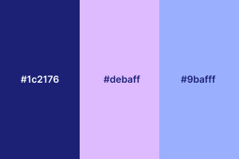

<div style="text-align:center; margin-top:300px;">

  

  <div style="margin-top:200px">
    <p>Développé par <strong>Miyuki CHERBAL</strong></p>
    <p>Titre professionnel visé : <strong>Développeur Web et Web Mobile</strong></p>
    <p>Novembre 2025</p>
  </div>

</div>

<div style="page-break-after: always;"></div>

---

# Sommaire

1. [Introduction](#1-introduction)

2. [Compétences du référentiel couvertes par le projet](#2-compétences-du-référentiel-couvertes-par-le-projet)

   - [2.1 Développer la partie front-end d’une application web ou web mobile sécurisée](#21-développer-la-partie-front-end-dune-application-web-ou-web-mobile-sécurisée)

   - [2.2 Développer la partie back-end d’une application web ou web mobile sécurisée](#22-développer-la-partie-back-end-dune-application-web-ou-web-mobile-sécurisée)

3. [Cahier des charges](#3-cahier-des-charges)
   - [3.1 Contexte et objectifs](#31-contexte-et-objectifs)
   - [3.2 User stories](#32-user-stories)
   - [3.3 Contraintes](#33-contraintes)

4. [Conception visuelle](#4-conception-visuelle)
   - [4.1 Palette de couleurs]
   - [4.2 Typographies et styles de texte] 
   - [4.3 Organisation des écrans / wireframes]
   - [4.4 Composants UI]
   - [4.5 Icônes]
   - [4.6 Responsivité et adaptations mobile/desktop]

5. Conception technique
   - 5.1 Technologies utilisées
   - 5.2 Versionning
   - 5.3 Architecture MVC
   - 5.4 Base de données
   - 5.5 Sécurité

6. [Présentation](#5-présentation)
   - [5.1 Front-end](#51-front-end)
   - [5.2 Back-end](#52-back-end)
   - [5.3 API](#53-api)

7. [Jeu d’essai](#6-jeu-dessai)
   - [6.1 *(à compléter)*](#61-à-compléter)

8. [Déploiement](#7-déploiement)

9. [Veille technologique](#8-veille-technologique)

10. [Recherche anglophone](#9-recherche-anglophone)
   - [9.1 Contexte de la recherche](#91-contexte-de-la-recherche)
   - [9.2 Extrait anglophone et traduction](#92-extrait-anglophone-et-traduction)

11. [Conclusion](#10-conclusion)
    - [10.1 Bilan global du projet](#101-bilan-global-du-projet)
    - [10.2 Roadmap](#102-roadmap)


<div style="page-break-after: always;"></div>

---

# 1. Introduction

Tosho est une application web conçue pour faciliter la gestion des prêts de livres au sein d’une école japonaise. En japonais, *Tosho* signifie *« bibliothèque »* ou *« livre »*.

L'origine de ce projet remonte directement à mon expérience personnelle. Ma fille, née en France, apprend le japonais dans une école destinée aux enfants d’origine japonaise. Cette école est gérée entièrement par des parents bénévoles, dont je fais partie. Nous y disposons d’une petite bibliothèque et nous prêtons régulièrement les livres aux familles afin que les enfants se familiarisent avec la lecture en japonais.

L’application actuellement utilisée pour les prêts de livres manque d’ergonomie et de fonctionnalités essentielles. L’interface administrateur n’est accessible que par le développeur initial, un ancien parent bénévole, et bien qu’elle reste fonctionnelle, elle présente une interface brute sans mise en forme CSS.

Tosho a pour objectif de simplifier la gestion des prêts de livres au quotidien, tout en offrant une expérience utilisateur plus fluide et moderne. Cette solution permet aux parents bénévoles de disposer d’un outil clair et autonome pour centraliser et gérer efficacement la bibliothèque.

Ce projet m’a permis de mettre en pratique les compétences acquises au cours de ma formation de Développeur Web et Web Mobile, de la conception au déploiement. J’ai pu expérimenter l’ensemble du processus de développement : analyse des besoins, architecture logicielle, gestion de la base de données, développement front-end et back-end, ainsi que la sécurisation des accès et la mise en place d’une interface responsive. 

Tosho est mon premier projet concret, reflet de mon apprentissage et de mon évolution en tant que développeuse, dont je suis fière de pouvoir présenter aujourd’hui !


<div style="page-break-after: always;"></div>

---


# 2. Compétences du référentiel couvertes par le projet 

## 2.1 Développer la partie front-end d’une application web ou web mobile sécurisée

### Installer et configurer son environnement de travail

Pour ce projet, j’ai utilisé **Visual Studio Code (VSCode)** comme environnement de développement, un IDE que j’utilise depuis le début de ma formation. Je l’ai progressivement configuré selon mes besoins, en installant diverses extensions utiles pour les langages de programmation et leurs frameworks, notamment :
- **PHP Intelephense** : pour bénéficier de l’autocomplétion, de la détection d’erreurs, et d’une meilleure navigation dans le code PHP.

- **PHP Namespace Resolver** : pour faciliter l’importation et la gestion automatique des namespaces dans les fichiers PHP.

- **Twig Language 2** : pour améliorer la coloration syntaxique et l’autocomplétion des fichiers Twig utilisés dans Symfony.

Cette configuration m’a permis de travailler de manière plus efficace et structurée tout au long du projet, en optimisant la lisibilité du code et en réduisant les erreurs de syntaxe.
Le projet est versionné avec **Git** et **GitHub** pour assurer le suivi des modifications et la sauvegarde.

### Maquetter des interfaces utilisateur web ou web mobile

J’ai réalisé les wireframes de mon application pour les formats mobile et desktop en utilisant **Figma**. Cette étape m’a permis de définir l’ergonomie et l’organisation des éléments. Ensuite, j’ai transformé ces wireframes en maquettes, ce qui m’a aidée à mieux anticiper les besoins visuels. Avoir un rendu concret sous les yeux m’aide à me projeter dans le développement et à rester concentrée sur le développement.

### Réaliser des interfaces utilisateur statiques web ou web mobile

J’ai intégré mes maquettes graphiques au fur et à mesure de l’avancement du développement back-end. Pour chaque route définie, j’ai créé un dossier dédié dans le répertoire des ``templates``, contenant les fichiers ```.twig``` nécessaires à l’affichage de la vue correspondante. Cette structure permet de maintenir une séparation claire entre les différentes parties de l’application et de gagner en efficacité lors de l’intégration des interfaces utilisateur. J’ai également veillé à ce que l’interface soit responsive.

### Développer la partie dynamique des interfaces utilisateur web ou web mobile

Pour rendre l’interface plus interactive, j’ai utilisé **JavaScript**, notamment pour automatiser certaines actions et améliorer l’expérience utilisateur. Par exemple, lors de la saisie d’un code ISBN dans le formulaire d’ajout d’un livre, un appel est automatiquement envoyé à une API externe. Celle-ci retourne les informations liées au livre : titre, auteur, image de couverture, etc. Ces données sont ensuite affichées dynamiquement dans le formulaire, sans rechargement de la page. 

## 2.2 Développer la partie back-end d’une application web ou web mobile sécurisée

### Mettre en place une base de données relationnelle

J’ai mis en place une base de données relationnelle avec **MySQL**. J’ai commencé par concevoir un modèle de données sur papier afin de définir les différentes entités et les relations entre elles. Ensuite, j’ai créé ces entités dans **Symfony** en utilisant **Doctrine ORM**. Chaque entité correspond à une table dans la base de données. Grâce à **l’interface en ligne de commande (CLI)** de Symfony, j’ai pu générer automatiquement la structure de la base de données, sans avoir à créer manuellement chaque table. Doctrine simplifie également la gestion des relations entre les entités (OneToMany, ManyToOne, etc.).

### Développer des composants d’accès aux données SQL et NoSQL

Pour accéder aux données stockées dans la base, j’ai utilisé les ``repositories`` fournis par Doctrine. Lorsqu’une requête est envoyée à un contrôleur, celui-ci interagit avec ``Entity Manager`` qui sert d’intermédiaire entre les contrôleurs et les repositories.
Les repositories permettent de récupérer, filtrer, modifier ou supprimer les données de manière sécurisée. Doctrine gère également les connexions à la base de données et applique automatiquement des protections contre les injections SQL.

### Développer des composants métier coté serveur

J’ai structuré mon projet selon **l’architecture MVC (Modèle – Vue – Contrôleur)** de Symfony, afin de séparer clairement la logique métier, l’affichage et le traitement des requêtes. Chaque URL est associée à une route, dirigée vers un contrôleur dédié à une fonctionnalité précise (par exemple : prêts des livres, gestion des inventaires etc.).
Les contrôleurs interagissent avec les entités pour récupérer ou modifier les données, puis transmettent les résultats aux vues. Ce mécanisme est utilisé notamment pour la gestion complète du CRUD des livres.

### Documentner le déploiement d’une application dynamique web ou web mobile

Pour le déploiement, j’ai utilisé **Docker**, ce qui permet de standardiser l’environnement de développement et de production. J’ai rédigé un ``dockerfile`` qui décrit toutes les étapes nécessaires pour construire l’image de l’application : installation des dépendances, configuration, copie des fichiers, etc.
Toutes les commandes nécessaires à l’exécution du projet avec Docker sont documentées dans le fichier ``README.md``. Cela permet à n’importe quel utilisateur de cloner le dépôt et de lancer l’application en quelques lignes de commande, sans avoir à configurer manuellement l’environnement.

<div style="page-break-after: always;"></div>

---


# 3. Cahier des charges
## 3.1 Contexte et objectifs
### Contexte
Le projet Tosho est inspiré d’une application web actuellement utilisée au sein d’une école japonaise associative qui propose des cours de japonais aux enfants d’origine japonaise résidant dans la région lyonnaise. L’école est entièrement gérée par des parents bénévoles, dont je fais partie, et met à disposition une petite bibliothèque afin d’encourager la lecture en japonais auprès des enfants.

Chaque semaine, les familles adhérentes peuvent emprunter des livres pour leurs enfants. Jusqu’à présent, ces prêts sont gérés via une application web existante, développée il y a plusieurs années par un ancien parent bénévole.
Le fonctionnement actuel est le suivant :

1. La famille choisit les livres à emprunter.

2. Chaque livre possède une étiquette avec un code unique (différent de l’ISBN) généré par l’association.

3. Le parent bibliothécaire saisit le nom de famille de l’emprunteur.

4. La liste des livres déjà empruntés par cette famille s’affiche.

5. Si la famille rapporte des livres, le bibliothécaire enregistre le retour de chaque livre.

6. Pour enregistrer un nouveau prêt, il saisit le code du livre correspondant.

Bien que cette application soit fonctionnelle, elle présente plusieurs limitations importantes :

- La partie administrateur (gestion des livres, des familles adhérentes, des bibliothécaires et des inventaires annuels) n’est pas accessible aux bénévoles actuels et nécessite toujours l’intervention du développeur d’origine.

- La recherche de familles n’est possible qu’en alphabet latin, ce qui rend la recherche en japonais (hiragana) impossible.

- L’interface est peu ergonomique, sans mise en page ni design CSS.

Ces contraintes rendent la gestion quotidienne de la bibliothèque peu flexible pour les parents bénévoles.

C’est dans ce contexte qu’a été conçu Tosho, une nouvelle application web de gestion des prêts de livres, pensée pour offrir une utilisation simple, fluide et autonome, sans dépendance à un intervenant technique extérieur.

### Objectifs

Le projet Tosho a pour objectif principal de faciliter et moderniser la gestion des prêts de livres au sein de l’école japonaise associative, tout en offrant aux parents bénévoles un outil simple, efficace et autonome.

Plus précisément, le projet vise à :

- Centraliser la gestion de la bibliothèque, en regroupant toutes les informations relatives aux livres, aux familles et aux bénévoles dans une interface administrateur claire et accessible.

- Améliorer l’ergonomie et l’expérience utilisateur, avec une interface intuitive, responsive et agréable à utiliser, adaptée aux besoins des bénévoles non techniques.

- Permettre un inventaire fiable et autonome, avec la possibilité de signaler facilement les livres manquants, mal rangés ou abîmés.

- Offrir une solution évolutive, qui pourra être enrichie ultérieurement de fonctionnalités supplémentaires (réservations, rappels automatiques, multilingue, etc.).

Ainsi, Tosho se positionne comme une solution moderne et complète, permettant aux bénévoles de gérer la bibliothèque de manière autonome et efficace, tout en garantissant un suivi fiable des prêts et retours de livres.

## 3.2 User stories

**Échelle de priorité :**  
- Priorité 0 : Obligatoire  
- Priorité 1 : Nécessaire  
- Priorité 2 : Secondaire


### Page de connexion

| En tant que...     | Je veux...                         | Afin de...                                        | Priorité |
|-------------------|------------------------------------|--------------------------------------------------|----------|
| Utilisateur (Admin ou Bibliothécaire) | Me connecter à l'application | Accéder à mes fonctionnalités selon mon rôle   | 0        |
| Utilisateur       | Récupérer mon mot de passe oublié   | Pouvoir accéder à nouveau à mon compte          | 0        |

### Gestion des prêts

| En tant que...          | Je veux...                                                       | Afin de...                             | Priorité |
|-------------------------|-----------------------------------------------------------------|---------------------------------------|----------|
| Bibliothécaire   | Enregistrer un prêt (livre, date, famille emprunteuse)          | Suivre les emprunts de livres         | 0        |
| Bibliothécaire   | Enregistrer le retour d’un livre                                 | Mettre à jour la disponibilité        | 0        |

---

### Inventaire (Côté bibliothécaire)

| En tant que...          | Je veux...                                                       | Afin de...                             | Priorité |
|-------------------------|-----------------------------------------------------------------|---------------------------------------|----------|
| Bibliothécaire   | Saisir l’ID d’un livre et valider sa présence lors de l’inventaire | Vérifier que le livre est bien là    | 1        |
| Bibliothécaire   | Signaler une anomalie                                           | Identifier anomalie                   | 1        |

---

### Gestion des livres (Admin uniquement)

| En tant que... | Je veux...                               | Afin de...                         | Priorité |
|----------------|-----------------------------------------|-----------------------------------|----------|
| Admin          | Ajouter un nouveau livre                 | Enrichir l’inventaire             | 1        |
| Admin          | Consulter les détails d’un livre        | Vérifier les informations         | 1        |
| Admin          | Modifier les informations d’un livre    | Corriger ou mettre à jour         | 1        |
| Admin          | Supprimer un livre                      | Retirer un livre obsolète         | 2        |

---

### Gestion des familles adhérentes (Admin uniquement)

| En tant que... | Je veux...                               | Afin de...                         | Priorité |
|----------------|-----------------------------------------|-----------------------------------|----------|
| Admin          | Ajouter une nouvelle famille             | Enregistrer les membres           | 1        |
| Admin          | Consulter les informations d’une famille| Vérifier les données              | 1        |
| Admin          | Modifier les informations d’une famille | Mettre à jour                     | 1        |
| Admin          | Supprimer une famille                    | Supprimer des adhérents            | 2        |

---

### Gestion des bibliothécaires (Admin uniquement)

| En tant que... | Je veux...                                      | Afin de...                                               | Priorité |
|----------------|-------------------------------------------------|----------------------------------------------------------|----------|
| Admin          | Créer un compte bibliothécaire                  | Leur permettre d'accéder à l'application                 | 1        |
| Admin          | Modifier un compte bibliothécaire               | Mettre à jour leurs informations                         | 1        |
| Admin          | Supprimer un compte bibliothécaire              | Retirer l'accès à quelqu'un qui ne fait plus partie      | 2        |
| Admin          | Voir la liste des bibliothécaires               | Gérer plus facilement l'équipe de gestion                | 1        |
| Admin          | Activer/désactiver un compte bibliothécaire    | Contrôler l'accès à l'application                        | 1        |

---

### Gestion de l’inventaire (Admin uniquement)

| En tant que... | Je veux...                                     | Afin de...                                               | Priorité |
|----------------|-----------------------------------------------|----------------------------------------------------------|----------|
| Admin          | Programmer une session d'inventaire          | Planifier quand les bénévoles vont vérifier les livres  | 1        |
| Admin          | Actualiser l'état d'inventaire (session ouverte/fermée/à venir, etc.) | Suivre correctement le statut de chaque session       | 1        |
| Admin          | Voir l'avancement de l'inventaire           | Savoir combien de livres ont été vérifiés et combien restent | 1        |
| Admin          | Modifier l'état des livres signalés         | Mettre à jour l’état après avoir réglé le problème     | 1        |
---
### Interface et sécurité

| En tant que...     | Je veux...                         | Afin de...                                        | Priorité |
|--------------------|------------------------------------|--------------------------------------------------|----------|
| Admin              | Passer de l’interface Admin à l’interface Bibliothécaire | Gérer la bibliothèque comme un parent bibliothécaire | 2        |
| Bibliothécaire     | Modifier mon mot de passe           | Sécuriser mon compte ou le mettre à jour         | 1        |
| Bibliothécaire     | Initialiser mon mot de passe        | En cas de perte de mot de passe                   | 0        |


## 3.3 Contraintes

- L’interface doit être **simple** et **intuitive**, adaptée à des utilisateurs non techniques. Les bibliothécaires et **les administrateurs sont des bénévoles**.
- L’accès aux fonctionnalités doit être restreint selon le rôle de l’utilisateur :
  - **Admin (parent bénévole)** : gère les familles, les livres, les bibliothécaires et l’inventaire.
  - **Bibliothécaire (parent bénévole)** : enregistre les prêts et retours, et participe aux sessions d’inventaire.
- Les données doivent être fiables et mises à jour en temps réel afin d’éviter les erreurs de double prêt ou de livres manquants.

<div style="page-break-after: always;"></div>

---

# 4. Conception visuelle

L’identité visuelle de **Tosho** a été pensée pour refléter l’esprit d’une association scolaire : à la fois **ludique**, **conviviale** et **accessible**.
L’objectif est de proposer une interface simple à comprendre, agréable à utiliser et adaptée aux parents bénévoles.

## 4.1 Palette de couleurs

### Couleurs principales



- ``#1c2176`` : pour le texte, les bordures et les icônes
- ``#debaff`` : couleur principale de l'interface **bibliothécaire**
- ``#9bafff`` : couleur principale de l'interface **admin**

### Couleurs des composants


## 4.2 Typographie
Le choix des polices a été fait avec soin pour garantir une lecture claire tout en apportant une touche moderne.


``"MuseoModerno"`` : pour les titres et le menu
``"Outfit"`` ; pour les textes courants

## 4.3 Logo & Icônes

### Logo


Le logo ***Tosho*** — qui signifie *livre* ou *bibliothéque* en japonais — a été conçu sur Figma. J'ai chosisi la police ``"Climate Crisis"`` pour son style rétro, en harmonie avec le style **pixel art** des icônes.


### Icônes
J'ai opté pour les icônes ``"Pixel free icons"`` au style **pixel art** pour apporter une touche **ludique** et **conviviale**. Elles ont également été exportées en SVG depuis Figma.

<div style="display:flex; margin-bottom:50px;">


</div>

### Favicon


## 4.4 Wireframes


## 4.5 Maquettes
## 4.6 Responsive

